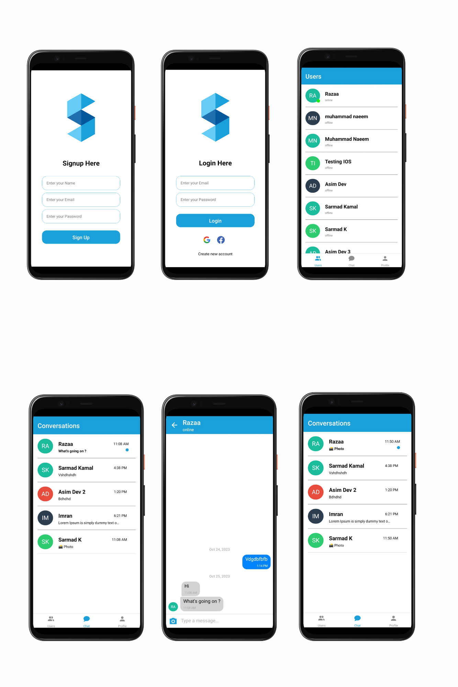

# shayanChat

## Motivation

The shayanChat app was born out of a deep-seated passion for enhancing human connections in the digital realm. In an era where communication has become increasingly fragmented and impersonal, our driving force is to create a platform that fosters genuine, meaningful interactions. We believe in the transformative power of technology to bridge gaps, cultivate understanding, and nurture relationships that transcend geographical boundaries. Our relentless pursuit of this vision fuels every aspect of ChatApp, propelling us to constantly innovate and create a space where people can truly connect, share, and thrive.

# Coding Style

#### React Native

* **Components:** Utilize functional components for improved performance and code readability.
* **Styling Approach:** Apply styles using the StyleSheet object to efficiently manage and reuse styles across components.
* **Variable Naming Conventions:** Follow the camelCase convention for naming variables and ensure descriptive names for improved code maintainability.
* **Reusable Functions:** Create a separate utils file to store reusable functions and utilize them throughout the application.


#### Prettierr Settings
*  **arrowParens:** avoid
*  **bracketSameLine:** true
*  **bracketSpacing:** false
*  **singleQuote:** true
*  **trailingComma:** all

# Interface ScreenShots



# Technology & Framework used

*  React Native
*  Firebase

# Features

*  **One-to-One Communication:** Enable private communication between users.
*  **Unread Message Indicator:** Provide a clear notification for unread messages.
*  **File Sharing:** Support the sharing of various file types, including images.
*  **New Message Notifications:** Send push or in-app notifications for new messages.
*  **User Status Display:** Show the current status of users (Online, Offline, etc.).
*  **Priority Display for Online Users:** Display online users first, followed by offline users on the user's screen.

# How to run

## Step 1: Start the Metro Server
To get started with this project, clone this repository to your local machine:

### `git clone`

Next, install the dependencies using npm:

### `yarn install`

Let Metro Bundler run in its _own_ terminal. Open a _new_ terminal from the _root_ of your React Native project. Run the following command to start your _Android_ or _iOS_ app:

### For Android

```bash
# using npm
npm run android

# OR using Yarn
yarn android
```

### For iOS

```bash
# using npm
npm run ios

# OR using Yarn
yarn ios
```

## Prerequisites
To run this project, you will need following installed on your machine.

### Requirements for Running the app on Android Emulator

* **Operating System:** Windows, macOS, or Linux
* **Memory (RAM):** At least 16 GB is required for better performance
* **Android Studio:** Installed with the Android SDK and AVD (Android Virtual Device) manager
* **openjdk version:** "11.0.2" 2019-01-15
* **Node version:** 18.18.0
* **npm:** 9.8.1
* **React Native CLI:** Installed globally on the system
* **Watchman:** Installed to watch for changes in the file system

### Requirements for Running the app on IOS Emulator

* **Operating System:** macOS (as iOS development is exclusively available on macOS)
* **Memory (RAM):** At least 16 GB is required for better performance
* **Xcode:**   Installed from the Mac App Store
* **openjdk version:** "11.0.2" 2019-01-15
* **Node version:** 18.18.0
* **npm:** 9.8.1
* **React Native CLI:** Installed globally on the system
* **Watchman:** Installed to watch for changes in the file system

# API references
We are Using [Chatkitty Api's](https://chatkitty.com/) to send and receive messages.

# Build Status / Errors
There are no errors or bugs in the project at all.

# How to Use?
__Sign up:__ Create an account on the shayanChat by providing the required information, such as name, email, and password.
__Login:__ Log in to your account using your credentials (username and password) to access the features.User can also sigin with your Google and Facebook account
__Users Screen:__ To access the Users screen, tap the bottom tab. The Users screen displays a list of all users, with the first online user followed by others. To start a conversation, click the user's name; to send a message, type in the text field and click "Send"; and to send images, click the camera icon.
__Chat Screen:__ The Chat Screen displays a list of previously chatted users, and if there's no chat history, it shows a message indicating no conversations.
__Profile Screeen:__ Profile screen shows the name currently logged in user and a logout button. User can simply logout by clicking that button.

# License
A succinct summary of the licence. Apache, MIT, etc.